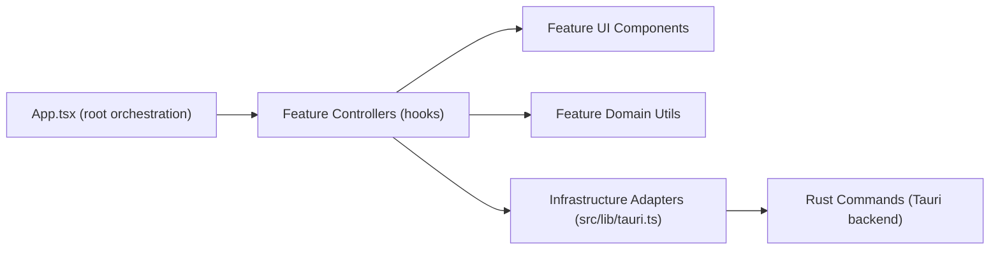
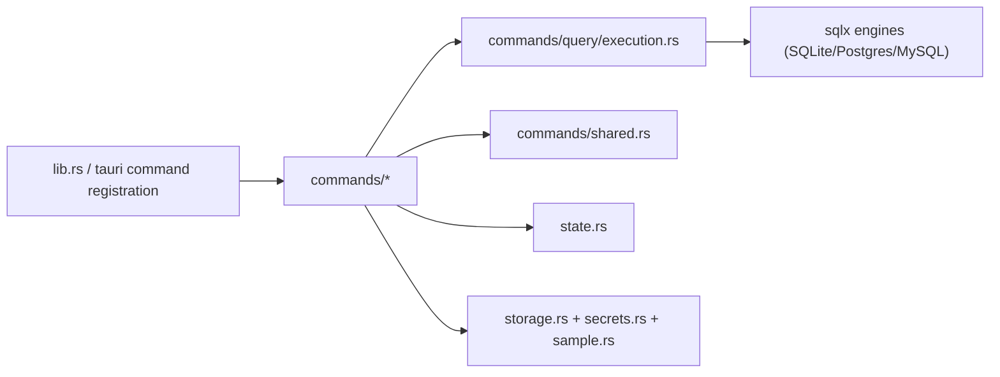

# DB Pro Architecture Boundaries

## Purpose

Lock module ownership and dependency rules after Sprint 2 refactor so feature work can continue without returning to `App.tsx`-centric coupling.

## Frontend Boundaries

### Layer map

### Ownership by module

| Module | Owns | Must not own |
|---|---|---|
| `src/App.tsx` | Page composition, controller wiring, transient top-level UI state | Query execution logic, navigator SQL generation rules, connection persistence behavior |
| `src/features/connections/useConnectionController.ts` | Connection CRUD/reset/cache orchestration, default sample handling from UI side | Query history, navigator fetch logic, SQL editor behavior |
| `src/features/query/useQueryController.ts` | Query run/cancel/history/selection/export orchestration | Grid debounce internals (moved to result-grid controller), navigator action routing |
| `src/features/query/useResultGridController.ts` | Page size, filter/sort modifiers, debounce + paging interactions | Query transport calls (delegated via callback), connection CRUD |
| `src/features/navigator/useNavigatorController.ts` | Navigator load/refresh/action dispatch and SQL template actions | Query history management, connection form state |
| `src/features/sql-editor/*` | SQL text editing, completions, formatting, statement targeting | Connection state and backend persistence |
| `src/features/*/*.tsx` | Presentation and intent emission via callbacks | Direct Tauri command invocation or shared mutable business state |
| `src/lib/tauri.ts` | Typed bridge to backend commands | Business decisions and UI-specific branching |

### Frontend dependency rules

- UI components can depend on:
  - local `ui` primitives
  - local feature types/utilities
  - controller callbacks/props
- UI components cannot depend directly on:
  - `@tauri-apps/api/core` invoke calls
  - other feature controllers' internals
- Controllers may depend on:
  - `src/lib/tauri.ts`
  - feature-local pure helpers (`history.ts`, `sql.ts`, `csv.ts`, etc.)
- Cross-feature type sharing must use explicit adapter contracts (current example: `src/features/query/controller-types.ts`).

## Backend (Rust) Boundaries

### Layer map

### Ownership by module

| Module | Owns | Must not own |
|---|---|---|
| `src-tauri/src/lib.rs` | App setup, storage bootstrap, sample auto-provisioning, command registration | SQL execution logic, schema extraction SQL |
| `src-tauri/src/commands/connection.rs` | Validate/upsert/delete/reset connection workflows | Query fetch/paging/filter logic |
| `src-tauri/src/commands/query/mod.rs` | Query request normalization, timeout/page limits, cancellation lifecycle registration | SQL dialect-specific row conversion details |
| `src-tauri/src/commands/query/execution.rs` | Engine-specific execution + pushdown/pagination behavior | Connection persistence, keychain operations |
| `src-tauri/src/commands/navigator.rs` | Schema metadata extraction for each engine | Query history/cancel flow |
| `src-tauri/src/commands/shared.rs` | Shared validators, URL conversion, timeout helpers | UI-specific messaging choices |
| `src-tauri/src/storage.rs` | Connection JSON store IO and corruption quarantine | Query execution logic |
| `src-tauri/src/secrets.rs` | Keychain read/write/delete | Query execution and schema loading |
| `src-tauri/src/sample.rs` | Sample SQLite schema + seed data bootstrap | Command routing or UI formatting |

## Critical Data Flows

### Query run + grid modifiers

1. UI emits run action from SQL editor pane.
2. `useQueryController` resolves statement target and calls backend via `executeQuery`.
3. `useResultGridController` governs paging/filter/sort rerun requests and delegates execution through `runQueryPage`.
4. Backend `commands/query/mod.rs` normalizes request + registers cancellation token.
5. `commands/query/execution.rs` executes engine-specific path and returns `QueryResult`.
6. Controller updates status/history/result state; UI components re-render.

### DDL -> navigator refresh

1. Query execution returns `schema_changed=true` for DDL first words (`create/alter/drop/...`).
2. `useQueryController` triggers `onRefreshNavigator`.
3. `useNavigatorController` reloads schema metadata and updates schema tree state.

### Reset data

1. UI reset intent goes through `useConnectionController`.
2. Backend `reset_connections` recreates sample SQLite, keeps only sample profile, clears non-sample secrets.
3. Frontend controllers clear local query/navigator caches and rehydrate from fresh sample connection.

## Anti-patterns (Explicitly Rejected)

- Re-introducing business logic into `App.tsx` beyond orchestration.
- Calling Tauri commands directly from presentational components.
- Letting query and navigator controllers mutate each other's internal state directly.
- Sharing untyped mutable objects across feature boundaries.
- Adding DB engine branching logic in frontend components.

## Review Checklist (S2-06 Gate)

- [x] Feature ownership documented for frontend and backend modules.
- [x] Data-flow diagrams for run query, DDL refresh, and reset data are documented.
- [x] Anti-pattern list and dependency rules are explicit.
- [x] Document references current refactored controllers (`useConnectionController`, `useQueryController`, `useNavigatorController`, `useResultGridController`).

Last updated: 2026-03-05.
